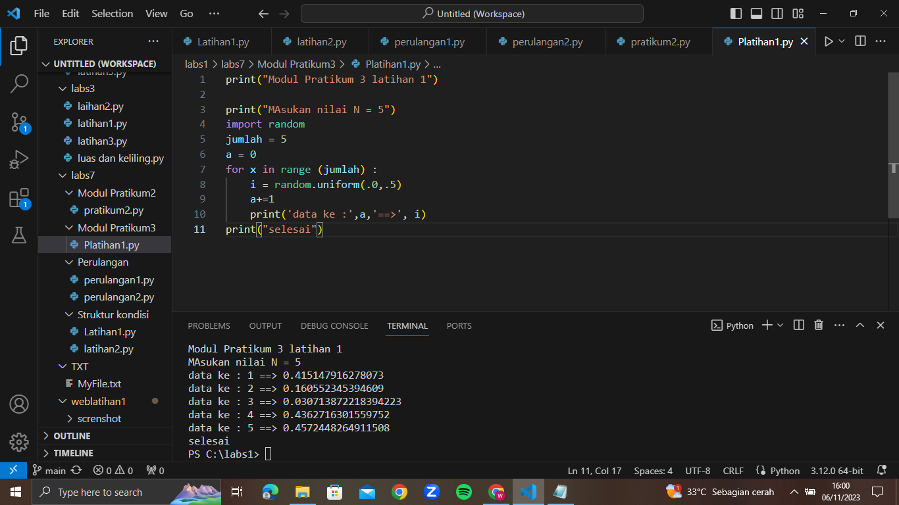

# pratikum7

 ## TUGAS STRUKTUR KONDISI
 ### latihan1

 Membuat program sederhada dengan input 2 buah bilangan, kemudian
 tentukan bilangan terbesar dari kedua bilangan tersebut
 menggunakan statement if.
 ``` python

 bil1 = int (input("Masukan bilangan : "))
 bil2 = int (input("Masukan bilangan : "))

 #Nilai terbesar

 if (bil1 > bil2):
    print("Bilangan terbesar :",bil1)

 #Nilai terkecil

 if (bil1 < bil2):
    print("Bilangan terbesar :",bil2)
 ### hasil program

```

### latihan2

membuat program untuk mengurutkan data berdasarkan input sejumlah
data dengan 3 variable input , dengan menampilkan
hasilnya secara berurutan mulai dari data terkecil.

``` python
bil1 = int(input("Bilangan ke-1: "))
bil2 = int(input("Bilangan ke-2: "))
bil3 = int(input("Bilangan ke-3: "))

data = [bil1, bil2, bil3]

print("Data sebelum di urutkan :", data)
list.sort(data)
print("Data setelah di urutkan :", data)
```
### hasil program


## TUGAS PERULANGAN
### latihan 1
membuat program dengan perulangan bertingkat (nested)
```python
baris = 10
kolom = baris

for bar in range(baris):
    for col in range(kolom):
        tab = bar+col
        print("{0:>5}".format(tab), end='')
    print()
```
### HASIL PROGRAM


### latihan 2
-Tampilkan n bilangan acak yang lebih kecil dari 0.5.
-nilai n diisi pada saat runtime
-anda bisa menggunakan kombinasi while dan for untuk
 menyelesaikannya

 ``` python
 import random
print("===========================================")
print("= Bilangan acak yang lebih kecil dari 0,5 =")
print("===========================================")

jum = int( input("Masukan jumlah n "))
i = 0
while i in range(jum):
    i += 1
    angkarandom = random.uniform(0,0.5)
    print( angkarandom)
```
### HASIL PROGRAM


## TUGAS MODUL PRATIKUM2
### latihan 1
membuat program sederhana dengan input tiga buah bilangan, dari ketiga bilangan
tersebut tampilkan bilangan terbesarnya. Gunakan statement if.
``` python
a = int(input("Masukan bilangan ke-1 :"))
b = int(input("Masukan bilangan ke-2 :"))
c = int(input("Masukan bilangan ke-3 :"))

max = a

if b > max:
    max = b

if c > max:
    max = c

print()
print("Nilai terbesar :", max)
```
### HASIL PROGRAM

### flowchart


## TUGAS MODUL PRATIKUM3
### latihan1
-Tampilkan n bilangan acak yang lebih kecil dari 0.5.
-nilai n diisi pada saat runtime
-anda bisa menggunakan kombinasi while dan for untuk menyelesaikannya
-gunakan fungsi random() yang dapat diimport terlebih dahulu
``` python
print("Modul Pratikum 3 latihan 1")

print("Masukan nilai N = 5")
import random
jumlah = 5
a = 0
for x in range (jumlah) :
    i = random.uniform(.0,.5)
    a+=1
    print('data ke :',a,'==>', i)
print("selesai")
```

### HASIL PROGRAM


### latihan2 
membuat program untuk menampilkan bilangan terbesar dari n buah data yang diinputkan.
Masukkan angka 0 untuk berhenti.
``` python
max=0
while True:
    a=int(input('Masukkan bilangan ='))
    if max < a :
        max = a
    if a==0:
        break
print('Bilangan Terbesar Adalah',max)    
```
### HASIL PROGRAM


### latihan3
membuar program sederhana dengan perulangan: Platihan1.py
Seorang pengusaha menginvestasikan uangnya untuk memulai usahanya dengan
modal awal 100 juta, pada bulan pertama dan kedua belum mendapatkan laba. pada
bulan ketiga baru mulai mendapatkan laba sebesar 1% dan pada bulan ke 5,
pendapatan meningkat 5%, selanjutnya pada bulan ke 8 mengalami penurunan
keuntungan sebesar 2%, sehingga laba menjadi 3%. Hitung total keuntungan selama 8
bulan berjalan usahanya.
``` python
a = 1000000000
for x in range(1,9) :
    if(x>=1 and x<=2) :
        b=a*0
        print('Laba bulan ke-',x,' :',b)
    if(x>=3 and x<=4) :
        c=a*0.1
        print('Laba bulan ke-',x,' :',c)
    if(x>=5 and x<=7) :
        d=a*0.5
        print('Laba bulan ke-',x,' :',d)
    if (x==8) :
        e=a*0.2
        print('Laba bulan ke-',x,' :',e)
total = b+b+c+c+d+d+d+e
print('\nTotal : ', total)
```
### HASIL PROGRAM


# "SELESAI :)"